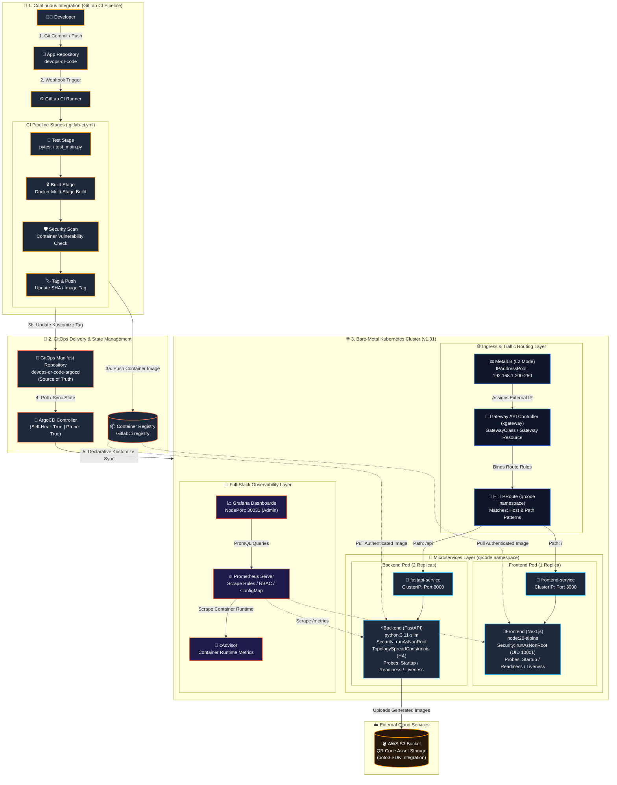

# Production-Grade GitOps QR Code Generator Platform

[](https://kubernetes.io/)
[](https://www.docker.com/)
[](https://about.gitlab.com/)
[](https://argoproj.github.io/cd/)
[-555555?logo=kubernetes&logoColor=white)](https://gateway-api.sigs.k8s.io/)
[](https://metallb.universe.tf/)
[](https://prometheus.io/)
[](https://github.com/google/cadvisor)
[](https://grafana.com/)
[](https://aws.amazon.com/s3/)
[](LICENSE)

A complete, production-ready **Cloud-Native & DevOps** portfolio project demonstrating a full lifecycle microservices deployment.Built on a self-hosted **Kubernetes (kubeadm) cluster** using modern **GitOps (ArgoCD)** principles, **Kubernetes Gateway API**, automated **GitLab CI/CD** pipelines and full-stack **Prometheus/Grafana** observability.

**Take a look at my first (Application) related repository:**  
**GitHub:** https://github.com/shotorouu/devops-qr-code/  
**GitLab:** https://gitlab.com/shotorouu/devops-qr-code/  

---

### 🌐 Modern Ingress & Networking

1. Gateway API Integration: Shifted from legacy ingress-nginx to kgateway (HTTPRoute / Gateway resources) for role-oriented traffic management.
2. Bare-Metal Load Balancing: Deployed MetalLB in Layer-2 mode to assign real external IPs without cloud provider lock-in.

### 🚀 Production GitOps & Delivery

1. Multi-Repo Architecture: Isolated application source code (devops-qr-code) from deployment state manifests (devops-qr-code-argocd).
2. ArgoCD Automated Sync: Enforced zero-drift reconciliation via selfHeal: true, prune: true, and ServerSideApply=true.
3. Declarative Overlays: Utilized Kustomize for dynamic image tagging and environment configs without Helm overhead.

### 🔒 Security & Container Resilience

1. Non-Root Runtime: Enforced runAsNonRoot: true (UID 10001) across minimal multi-stage builds (python:3.11-slim / node:20-alpine).
2. High Availability: Implemented topologySpreadConstraints, zero-downtime rolling updates (maxSurge: 25%, maxUnavailable: 0), and full 3-stage health probes.

### 📊 Full-Stack Observability

1. Application Telemetry: Integrated native /metrics endpoints via prometheus_fastapi_instrumentator and Next.js metric handlers.
2. Dynamic Discovery: Auto-scraped by Prometheus via Pod annotations, paired with cAdvisor container metrics under minimal RBAC permissions.

---

# 🗽 Architecture & Workflow




# 🐙ArgoCD (GitOps) repository (https://github.com/shotorouu/devops-qr-code-argocd)

```
devops-qr-code-argocd/
├── application-infra.yml      # ArgoCD Application for Infrastructure (Gateway API & MetalLB)
├── application.yml            # ArgoCD Application for Microservices & Monitoring
├── dev/                       # Workload & Monitoring Manifests (Kustomize Overlay)
│   ├── fastapi_deployment.yml # FastAPI Deployment (Probes, TopologySpread, Non-Root)
│   ├── fastapi_service.yml    # ClusterIP Service for API
│   ├── frontend_deployment.yml# Next.js Deployment
│   ├── frontend_service.yml   # ClusterIP Service for Frontend
│   ├── httproute.yml          # Gateway API HTTPRoute definition
│   ├── kustomization.yml      # Kustomize manifest list & dynamic image tags
│   └── monitoring/            # Observability Stack
│       ├── grafana-deployment.yml
│       ├── grafana-service.yml
│       ├── prometheus-configmap.yml
│       ├── prometheus-deployment.yml
│       ├── prometheus-rbac.yml
│       └── prometheus-service.yml
├── infra/                     # Infrastructure Manifests
│   ├── gateway.yml            # Gateway API Class definition
│   ├── kustomization.yml      # Kustomize infra configuration
│   └── metallb.yml            # MetalLB IPAddressPool & L2Advertisement
└── README.md
```

# 🐍Application repository (https://github.com/shotorouu/devops-qr-code)

```
devops-qr-code/
├── api/
│   ├── Dockerfile             # Multi-stage non-root Python build
│   ├── main.py                # FastAPI app (Prometheus instrumented + AWS S3 SDK)
│   ├── requirements.txt
│   └── test_main.py           # Unit testing suite
├── front-end-nextjs/
│   ├── Dockerfile             # Multi-stage non-root Next.js build
│   ├── jsconfig.json
│   ├── next.config.js
│   ├── package.json
│   ├── package-lock.json
│   ├── postcss.config.js
│   ├── public/
│   ├── src/
│   │   └── app/
│   │       ├── metrics/       # Custom Next.js Prometheus metrics exporter route
│   │       ├── layout.js
│   │       └── page.js
│   └── tailwind.config.js
├── .gitlab-ci.yml             # Build, image push, and GitOps tag update pipeline
├── LICENSE
└── README.md
```

# 🚀 Complete Local Deployment & Setup Guide
## Prerequisites🎯:
1. A running Kubernetes cluster (v1.28+) (e.g., kubeadm, minikube, or k3s).
2. kubectl CLI installed and connected to your cluster.
3. ArgoCD installed in the argocd namespace.
4. AWS account with an active S3 bucket and IAM account with credentials.

### Step 1✅: Create AWS Credentials Secret. The application requires AWS credentials to save generated QR codes into an S3 bucket. Create the secret manually prior to syncing workloads:
```bash
# Option A: Create secret from an existing .env file
# Create a file named api/.env with:
# AWS_ACCESS_KEY="your-access-key"
# AWS_SECRET_KEY="your-secret-key"
# AWS_BUCKET_NAME="your-bucket-name"
kubectl create secret generic aws-creds --from-env-file=api/.env -n qrcode

# Option B: Create secret directly via command line
kubectl create secret generic aws-creds \
  --from-literal=AWS_ACCESS_KEY="YOUR_AWS_ACCESS_KEY" \
  --from-literal=AWS_SECRET_KEY="YOUR_AWS_SECRET_KEY" \
  --from-literal=AWS_BUCKET_NAME="YOUR_S3_BUCKET_NAME" \
  -n qrcode
```

### Step 2✅: Configure MetalLB IP RangeEdit infra/metallb.yml to reflect an available IP address range on your local network:
```yaml
apiVersion: metallb.io/v1beta1
kind: IPAddressPool
metadata:
  name: local-ip-pool
  namespace: metallb-system
spec:
  addresses:
    - 192.168.1.200-192.168.1.250  # Update this range for your subnet
```

### Step 3✅: Deploy ArgoCD GitOps Applications
```bash
# 1. Deploy Infrastructure Application (MetalLB & Gateway API)
kubectl apply -f application-infra.yml

#2. Deploy Application Workloads & Observability Stack
kubectl apply -f application.yml
```

### Step 4✅: Verify Deployment & Networking
```bash
# Check ArgoCD sync status
kubectl get applications -n argocd

# Check running workloads
kubectl get pods -n qrcode

# Retrieve Gateway API external IP assigned by MetalLB
kubectl get gateway -n gateway-qrcode
kubectl get httproute -n qrcode
```

### Step 5: Accessing Services

| Component | Access Method | Endpoint / Address |
| :--- | :--- | :--- |
| **Frontend UI** | MetalLB LoadBalancer | `http://<METALLB_GATEWAY_IP>/` |
| **FastAPI Backend** | MetalLB Route / API | `http://<METALLB_GATEWAY_IP>/api/` |
| **Prometheus UI** | NodePort / Port-Forward | `http://<NODE_IP>:30090` |
| **Grafana UI** | NodePort | `http://<NODE_IP>:30031` |

```yaml
metadata:
  annotations:
  prometheus.io/scrape: "true"
  prometheus.io/port: "8000"
  prometheus.io/path: "/metrics"
```
To configure Grafana dashboards:
1. Log into Grafana at http://<NODE_IP>:30031.
2. Navigate to Connections > Data Sources and add Prometheus (http://prometheus-service.qrcode.svc.cluster.local:9090).
3. Import community dashboards for Kubernetes container metrics (e.g. ID 15760 for cAdvisor / Node exporter metrics).

### This project is licensed under the MIT License⚖️.
